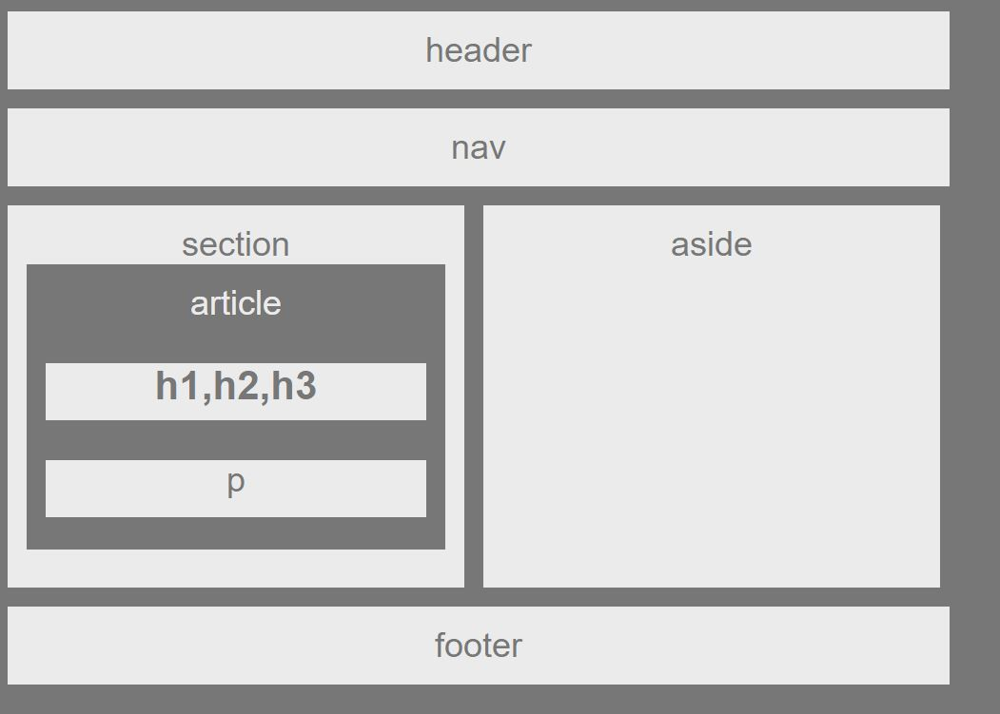

<!-- Put the name of the project after the # -->
<!-- the # means h1  -->
# Homework # 1 - building a Wireframe

<!-- Put a description of what the project is -->
To build a web design skeleton using html/css. 

# Link to deployed site
<!-- make a link to the deployed site --> 
<!-- [What the user will see](the link to the deployed site) -->
[my first homework](https://syamkanduri1.github.io/HW-Wireframe/)


# Images
<!-- take a picture of the image and add it into the readme  -->
<!--  -->



# technology used
<!-- make a list of technology used -->
<!-- what you used for this web app, like html css -->

html, css
<!-- 
1. First ordered list item
2. Another item
⋅⋅* Unordered sub-list. 
1. Actual numbers don't matter, just that it's a number
⋅⋅1. Ordered sub-list
4. And another item. 
-->


# code snippets
<!-- put snippets of code inside ``` ``` so it will look like code -->
<!-- if you want to put blockquotes use a > -->

```
In the html file, I have coded..
<aside id="right">
    aside
</aside>

associated class in CSS file is

#right {
    float: left;
    width: 25%;
    margin-left: 5px;
  }

```


# Learning points
<!-- Learning points where you would write what you thought was helpful -->
Chrome DevTools tool was helpful to get job done; however, I ended up doing lot of hardcoding for now to get the job done. Need thorough reivew / guidance to help remove hardcodes..

# Author 
Syam Kanduri

# License
Standard MIT License